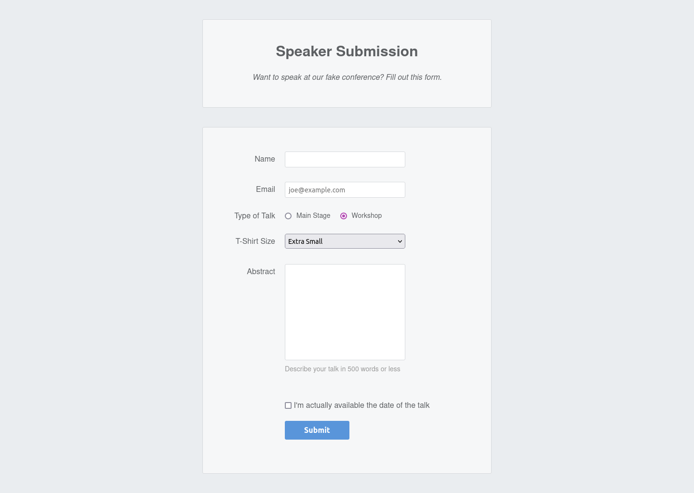

# Interneting Is Hard - Forms

This is a solution to the [Forms tutorial No. 13 of HTML & CSS Is Hard](https://www.internetingishard.com/html-and-css/forms/).

## Table of contents

- [Overview](#overview)
  - [Screenshot](#screenshot)
  - [Links](#links)
- [My process](#my-process)
  - [Built with](#built-with)
  - [What I learned](#what-i-learned)
  - [Continued development](#continued-development)
  - [Useful resources](#useful-resources)
- [Author](#author)
- [Acknowledgments](#acknowledgments)

## Overview

### Screenshot

### Links

- Solution URL: [Forms solution](https://github.com/jugglingdev/forms)
- Live Site URL: [Forms live site](https://jugglingdev.github.io/forms/)

## My process

### Built with

- Semantic HTML5 markup
- CSS custom properties

### What I learned

I really enjoyed this tutorial.  Supposedly forms are hard, but at least I find them fun to build.

The `<form>` element takes `action` and `method` attributes which define the web server's URL to process the data in the backend and how the form is submitted.  Use `method="post"` when changing data and `method="get"` when only getting data.

*Text Input Fields*

### Continued development

Use this section to outline areas that you want to continue focusing on in future projects. These could be concepts you're still not completely comfortable with or techniques you found useful that you want to refine and perfect.

### Useful resources

- [Example resource 1](https://www.example.com) - This helped me for XYZ reason. I really liked this pattern and will use it going forward.
- [Example resource 2](https://www.example.com) - This is an amazing article which helped me finally understand XYZ. I'd recommend it to anyone still learning this concept.

## Author

- GitHub - [@jugglingdev](https://github.com/jugglingdev)

- freeCodeCamp - [@jugglingdev](https://www.freecodecamp.org/jugglingdev)

- Frontend Mentor - [@jugglingdev](https://www.frontendmentor.io/profile/jugglingdev)

- LinkedIn - [Kayla Paden](https://www.linkedin.com/in/kayla-marie-paden)

## Acknowledgments

Shoutout to Oliver James for his dedication to publishing and maintaining InternetingIsHard.com.  His tutorials were the first that really clicked for me.